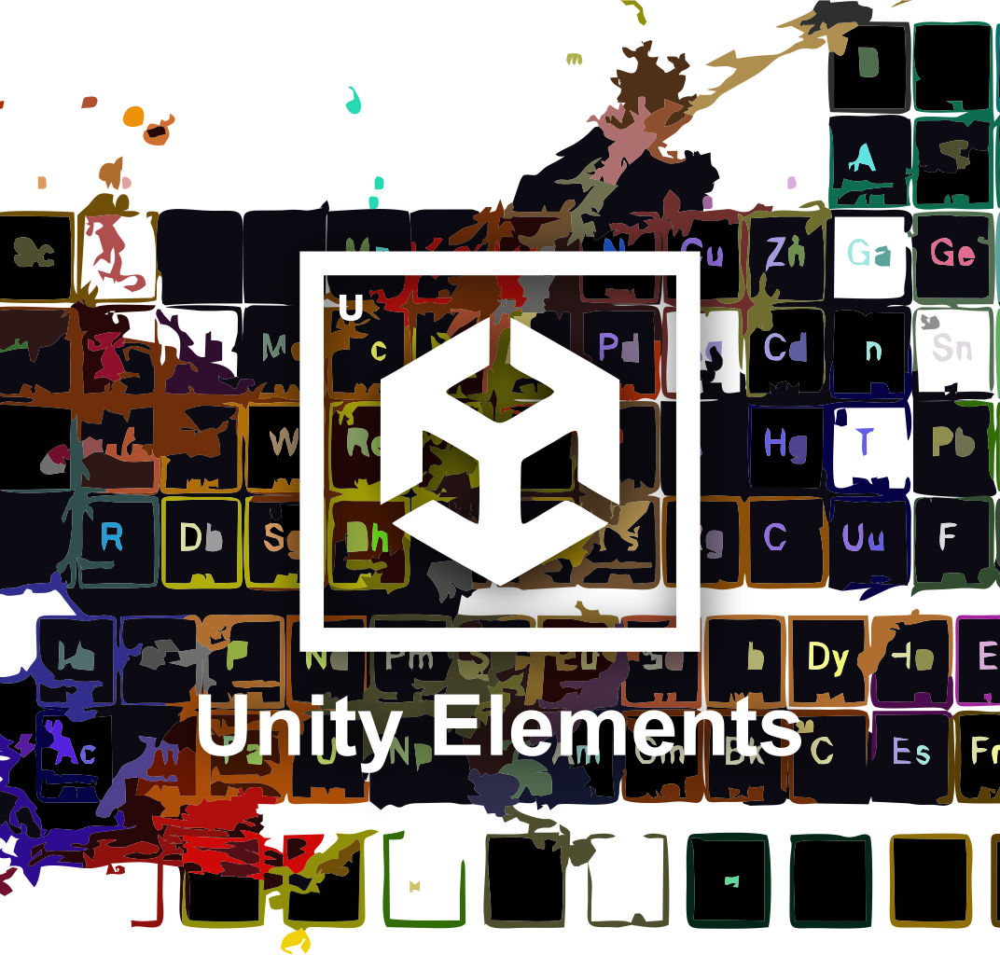

 
<h4 align="center" style="text-align:center;">
     
 
 
 

Discover Unity Elements - your periodic table of essential tips and resources for Unity game developers. From coding fundamentals to advanced techniques, explore every "element" you need to craft your next masterpiece.

<h5 align="center" style="text-align:center;">
    
 Here you will find, renowned paid assets, and invaluable resources to enhance your project. Explore helpful applications, must-read books, influential creators, and inspiring YouTube channels to guide you on your journey.

</h5>
<h5 align="center" style="text-align:center;">
    
 But remember, the goal here is to discover new tools, ideas, and methods to create amazing things. No need to memorize the entire table—just return anytime to review and find what you need 😉! 
     
     
     
    Want to check it!? Click <a href="https://thisaislan.github.io/unity-elements/">here!</a> 

    
</h5>
 

##
> If you like the style of the page, don't miss the original page from Mike Golus [here](https://codepen.io/mikegolus/pen/OwrPgB). Or if you want to know where I found inspiration for the banner, you can see  [here](https://pixels.com/featured/colorful-periodic-table-of-the-elements-on-black-with-water-splash-eti-reid.html)

##
<!--
  ko-fi donation button 
 -->
 
 
 
 
 
 
<h4 align="center" style="text-align:center;">
  
</h4>
 
 
 
 